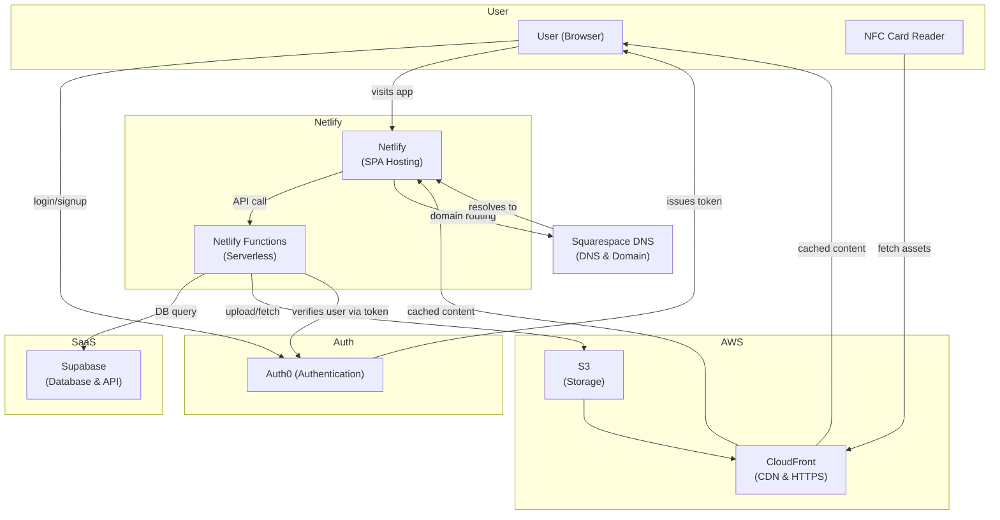

# Tech Stack

Tagme Connect is a SPA enhanced by lambda functions tied to the netlify environment, with support through Supabase, and AWS S3 for object persistence. It exists to be as inexpensive to the client to keep running. 


**Architecture Overview:**  
- Squarespace DNS points the domain to Netlify where the SPA is hosted.  
- Auth0 handles authentication, issuing tokens used by both browser and Netlify Functions.  
- Netlify Functions are invoked by the app, handling business logic, and independently communicating with Supabase (for DB) and S3 (for assets).  
- CloudFront provides caching, HTTPS termination, and is accessible directly to end users via browser and NFC card readers for asset retrieval.


## Frontend

The frontend is a React Router Single Page Application (SPA) which uses Netlify Functions for server matters. The React Router framework configuration is the successor to Remix V2, and uses ClientLoader and ClientActions for asynchronous loading and acting. 


## Backend & APIs

The backend consists of Netlify Functions. 

## Data Layer

| Component | Purpose |
| --- | --- |
| Supabase (Postgres SaaS) | Primary relational database for customers, orders, cards, and assets |
| Supabase Auth | Authentication for internal tooling or customer portals (if enabled) |
| Supabase Storage (optional) | Holds generated card assets when not stored in S3 |

### Local vs. Remote

- **Local development** uses the Supabase CLI to spin up disposable Postgres + Studio containers.
- **Staging/Production** uses Supabase-hosted projects configured via the Supabase dashboard.

## File Storage & Distribution

| Service | Description |
| --- | --- |
| AWS S3 | Canonical storage for uploaded artwork, generated images, HTML, and VCF payloads |
| AWS CloudFront | Global CDN providing caching, HTTPS termination, and publicly accessible asset delivery to browsers and NFC card readers |
| Netlify Asset CDN | Caches static frontend assets built by Vite |

### Workflow

1. Netlify Function receives a card order.
2. Business logic stores metadata in Supabase; Netlify Function uploads artifacts to AWS S3.
3. CloudFront caches assets and provides them to end users (browser and NFC card readers) with HTTPS.
4. CloudFront invalidations ensure fresh assets reach customers quickly.

## Domain & DNS

| Service | Description |
| --- | --- |
| Squarespace Domains | Hosts the apex/domain registration |
| Route Delegation | Squarespace DNS records point `tagmeconnections.com` (or equivalent) to Netlify |
| CNAME/ANAME Records | Configure Netlify-managed subdomains and CloudFront distribution aliases |

In addition, CNAME records are set to the c.tagmeconnections.com

## Hosting & Deployment


> [!IMPORTANT]  
> In order to deploy, Connie Crucil must make an edit herself to the README at https://github.com/conniecrucil/tagme-connect. In the future, a proper release mechanism using github actions should be considered. This ensures that she can use the netlify free plan. 


| Service | Description |
| --- | --- |
| Netlify Sites | Hosts the built React Router app and orchestrates serverless functions |
| Netlify Build Pipeline | Runs `npm install`, `npm run build`, deploys assets to Netlify CDN |
| Netlify CLI | Used locally to emulate production environment and trigger deploys |


## Observability & Operations

| Tool | Description |
| --- | --- |
| Netlify Logs | Request tracing and function logs |
| Supabase Studio | Query and monitor database health |
| AWS CloudWatch (optional) | Monitor S3/CloudFront access patterns |

## Environment Management

- **Environment variables** are centralized in `.env` (local) and Netlify dashboard (cloud).
- Secrets for AWS and Supabase are stored in Netlify environment configuration.
- Supabase service roles and anon keys are injected at build time via Netlify.

## Integration Overview

```
[Client App (Browser)]
    ⇅ (HTTPS)
[Netlify Functions]
    ⇅ (SQL)           ⇅ (S3 SDK)
[Supabase SaaS]       [AWS S3]
                          ↓
                    [CloudFront CDN]
                          ↓
              [User (Browser) & NFC Card Reader]

DNS: Squarespace → Netlify & CloudFront
```

This architecture ensures customer experiences are fast, secure, and maintainable while keeping infrastructure lightweight for the Connie team.
